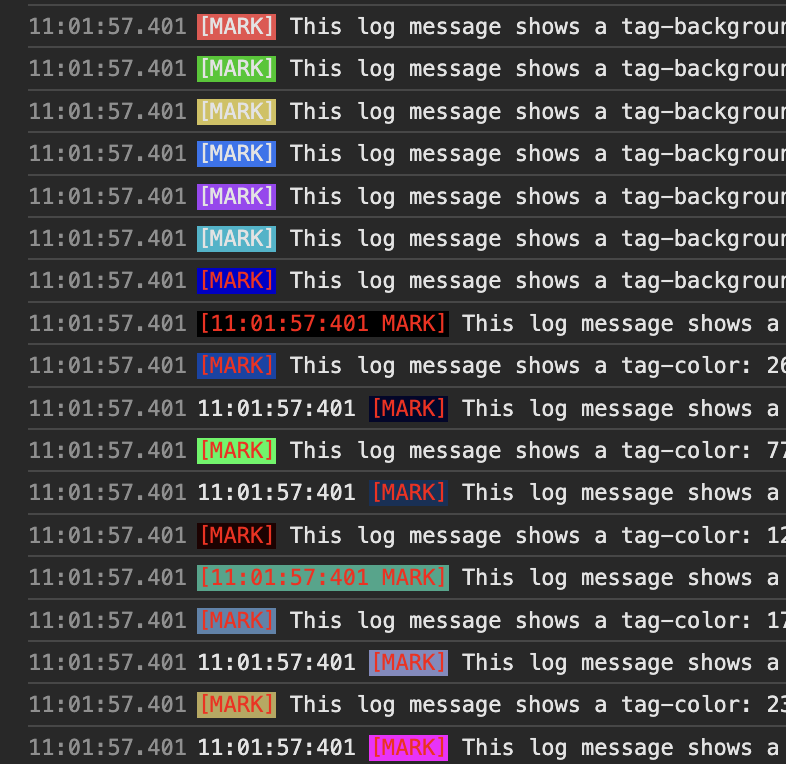
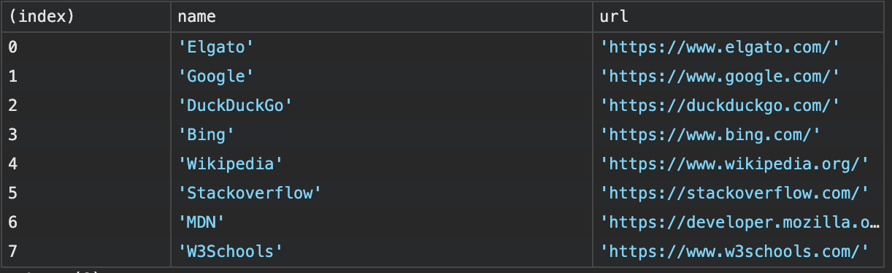

# Teach your console some new tricks




Although it shows its age, the Javascript console is still a powerful tool. It can be used to log messages, objects, arrays, display tables, and even to style the output. And - if you're like me - you probably use it every day. Here are some tricks to make it even more useful or nicer to look at.

This is not new and not going to be a comprehensive list of all the things you can do with the console, but some things I use every day and it might give you some new ideas.

If you want to learn more, I recommend the [MDN documentation](https://developer.mozilla.org/en-US/docs/Web/API/Console).
Or you can check out the [Chrome DevTools documentation](https://developers.google.com/web/tools/chrome-devtools/console/console-reference).
Or one of the many other resources available on the web (e.g. [this one](https://stackoverflow.com/questions/4842424/list-of-ansi-color-escape-sequences)).

```javascript
const timestamp = () => {};
timestamp.toString = function() {
    const date = new Date();
    const hours = date.getHours().toString().padStart(2, '0');
    const minutes = date.getMinutes().toString().padStart(2, '0');
    const seconds = date.getSeconds().toString().padStart(2, '0');
    const milliseconds = date.getMilliseconds().toString().padStart(3, '0');
    return `${hours}:${minutes}:${seconds}:${milliseconds}`;
};

// log with a mark, color, and timestamp
// e.g.: 
// 08:35:01:232 [LOG]  This log message shows a red tag and timestamp

const dbgConsole = (mark = "DEBUG", tagClr = "#999999", type = "log", includeTimeStamp = false) => {
    if(isNaN(tagClr)) {
        if(includeTimeStamp) {
            return console[ type ].bind(console, `%s %c[${mark}] `, timestamp, `color:${tagClr};`);
        }
        return console[ type ].bind(console, `%c[${mark}] `, `color:${tagClr};`);
    }
    const s = `\x1b[${tagClr}m[${mark}]\x1b[0m`;
    return console[ type ].bind(console, s);
};

const makeConsole = ({ mark = "DEBUG", color, backgroundColor, type = "log", includeTimeStamp = false, timeStampInMark = false }) => {
    if(isNaN(color)) {
        const colors = `${color ? `color:${color};` : ''}${backgroundColor ? `background-color:${backgroundColor};` : ''}` || '';
        if(includeTimeStamp) {
            if(timeStampInMark) {
                return console[ type ].bind(console, `%c[${timestamp} ${mark}]`, colors);
            }
            return console[ type ].bind(console, `%s %c[${mark}]`, timestamp, colors);
        }
        return console[ type ].bind(console, `%c[${mark}]`, colors);
    }
    // Ansi color codes for the terminal specify the color as a number
    // 30-37: foreground color
    // 40-47: background color
    const terminalColor = color > 39 ? `38;5;${color}` : color || 31;
    const s = `\x1b[${terminalColor}m[${mark}]\x1b[0m`;
    return console[ type ].bind(console, s);
};

let log = dbgConsole("LOG", 31);
log("This log message shows a reddish tag");
log = dbgConsole("LOG", 33);
log("This log message shows a orange tag");


log = dbgConsole("LOG", 'red', undefined, true);
log("This log message shows a red tag and timestamp");

log = dbgConsole("LOG", '#03F');
log("This log message shows a blue tag");

log = dbgConsole("LOG", 34, 'warn', true);
log("This warning shows a lighter blue tag");

for(let i = 30;i < 37;i++) {
    log = dbgConsole("LOG", i);
    log(`This log message shows a tag-color: ${i}`);
}

for(let i = 0;i < 11;i++) {
    const n = Math.ceil(i * 255 / 10);
    const j = (n ** 3 + Math.pow(16, 6)).toString(16).substr(-6);
    log = dbgConsole("LOG", `#${j}`);
    log(`This log message shows a tag-color: ${n} => #${j}`);
}

log = makeConsole({ mark: "MARK", color:31});
log("This log message shows a reddish tag");

log = makeConsole({ mark: "MARK", color: 31, emphasised: true });
log("This log message shows some other font style");

for(let i = 30;i < 37;i++) {
    log = makeConsole({ mark: "MARK", color: i });
    log(`This log message shows a tag-color: ${i}`);
}

for(let i = 40;i < 47;i++) {
    log = makeConsole({ mark: "MARK", color: i });
    log(`This log message shows a tag-background-color: ${i}`);
}

log = makeConsole({ mark: "MARK", color:'#F00', backgroundColor: '#00C' });
log(`This log message shows a tag-background-color: #090`);

for(let i = 0;i < 11;i++) {
    const n = Math.ceil(i * 255 / 10);
    const j = (n ** 3 + Math.pow(16, 6)).toString(16).substr(-6);
    log = makeConsole({ mark: "MARK", color: 'red', backgroundColor: `#${j}`, includeTimeStamp: i % 2 === 0, timeStampInMark: i % 3 === 0});
    log(`This log message shows a tag-color: ${n} => #${j}`);
}

```

### Table

```javascript
const links = [
    { name: 'Elgato', url: 'https://www.elgato.com/', tag: 'tools'},
    { name: 'Google', url: 'https://www.google.com/', tag: 'search'},
    { name: 'DuckDuckGo', url: 'https://duckduckgo.com/', tag: 'search'},
    { name: 'Bing', url: 'https://www.bing.com/', tag: 'search'},
    { name: 'Wikipedia', url: 'https://www.wikipedia.org/', tag: 'knowledge'},
    { name: 'Stackoverflow', url: 'https://stackoverflow.com/', tag: 'knowledge'},
    { name: 'MDN', url: 'https://developer.mozilla.org/', tag: 'knowledge'},
    { name: 'W3Schools', url: 'https://www.w3schools.com/', tag: 'knowledge'}
];

// show above links as a table
console.table(links);

// show only the name and url of the links
console.table(links, ['name', 'url']);


```





